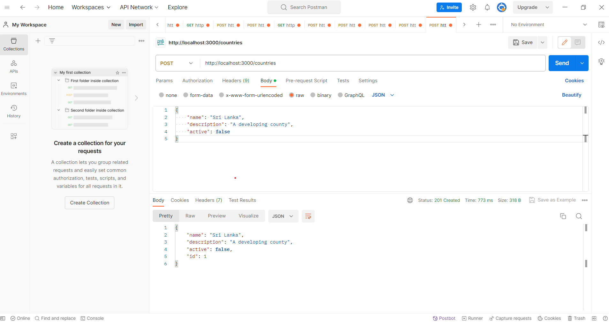
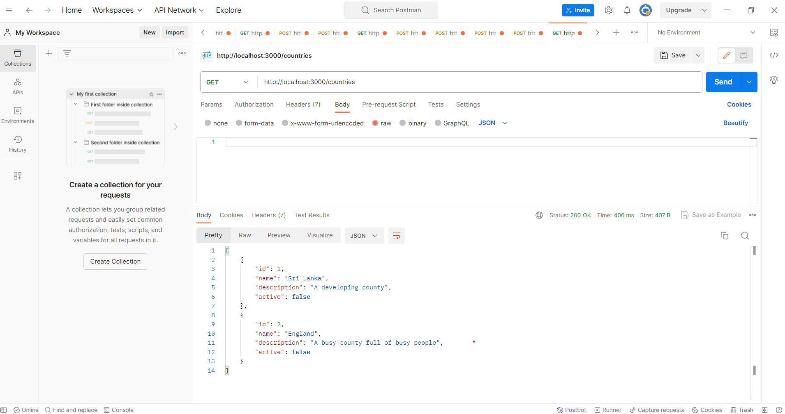
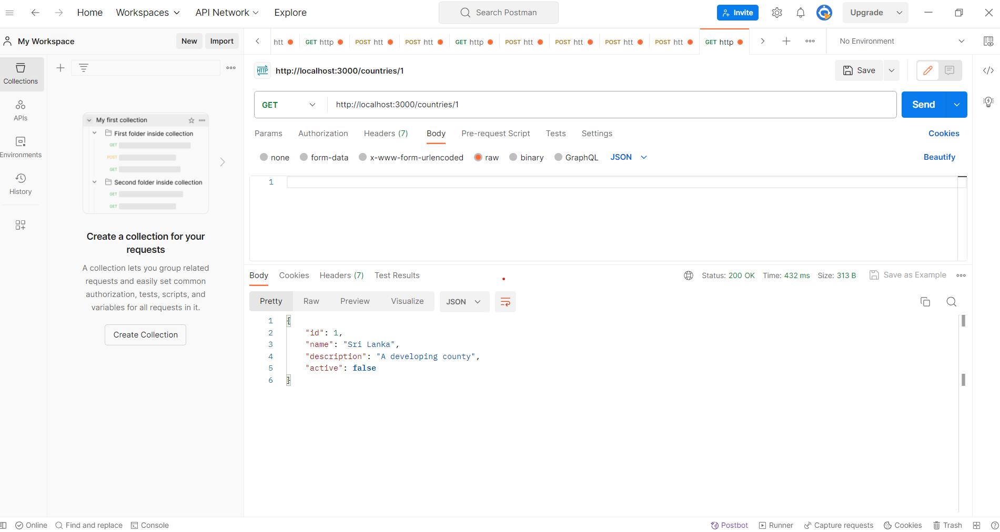
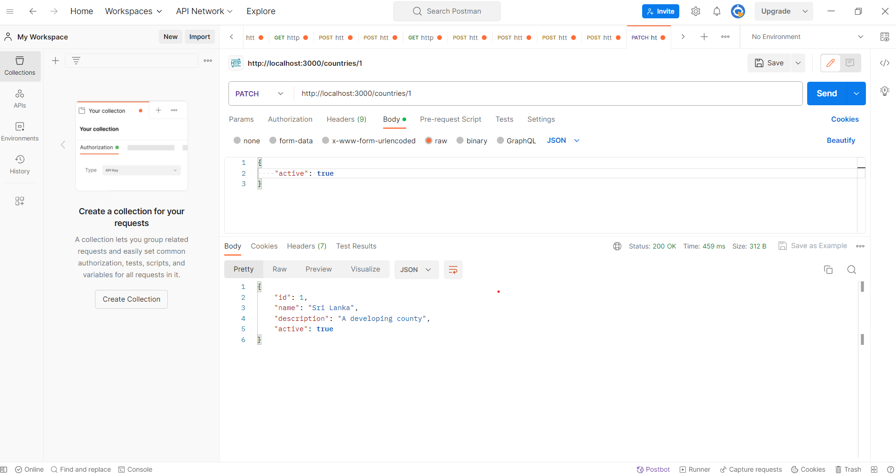
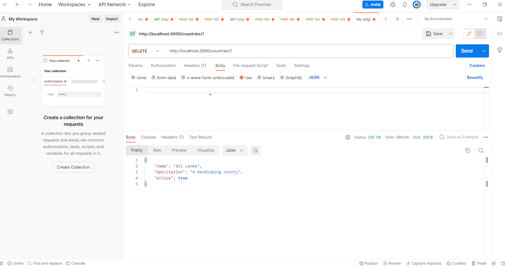
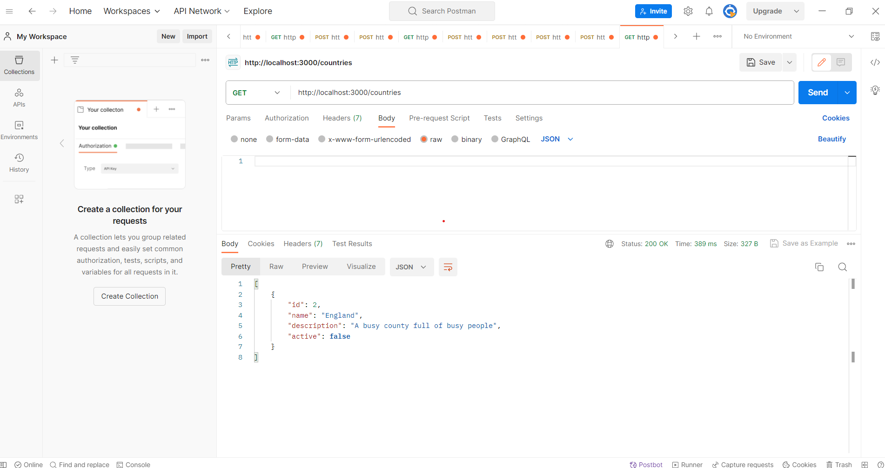
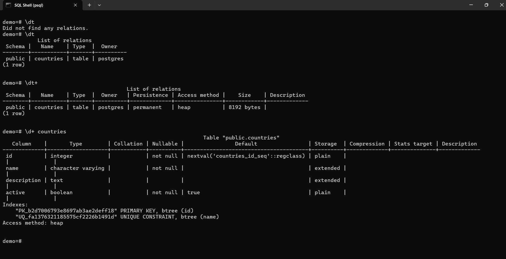
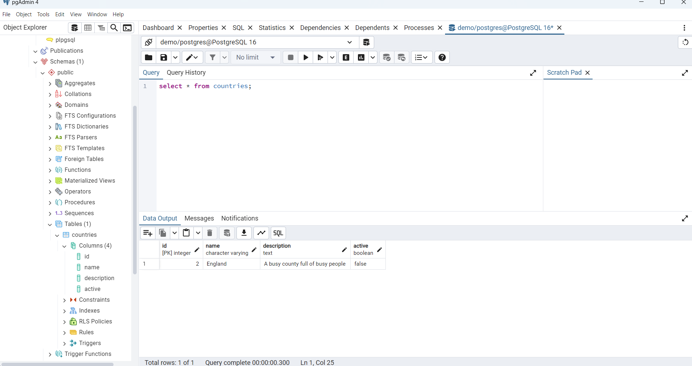

## PostgreSQL CRUD REST API with NestJS and TypeORM

This repository implements a RESTful API using ***NestJS*** and ***TypeORM*** for performing CRUD (Create, Read, Update, Delete) operations on a PostgreSQL database. The project focuses on backend API development and database integration, validated through ***Postman***.

## Project Purpose

This project is created to:
- Demonstrate how to build RESTful APIs using ***NestJS*** and ***TypeORM***.
- Provide a boilerplate for integrating PostgreSQL with a structured framework.
- Serve as a reference for connecting APIs to a relational database.
- Showcase testing of APIs using ***Postman***.

## Features
- CRUD Operations:
Perform Create, Read, Update, and Delete operations on PostgreSQL entities.
- API Endpoints:
RESTful endpoints designed for seamless interaction with the database.
- Database Integration:
Efficient handling of relational data using ***TypeORM***.
- Validation and Testing:
API endpoints tested and validated using ***Postman***.
- Scalable Framework:
Built using ***NestJS***, following modular architecture for scalability and maintainability.

## Tech Stack
- Framework:
NestJS (Node.js framework).
- Database:
PostgreSQL.
- ORM:
TypeORM for object-relational mapping.
- Testing Tool:
Postman for API endpoint validation.

## Setup Instructions

Follow these steps to set up and test the API locally:
1. Clone the repository:
```
$ git clone https://github.com/KalhariEkanayake/nestJs-projects.git
$ cd pg-crud
```

2. Install dependencies:
```
$ npm install
```

4. Start the server:
```
$ npm run start
```

6. Test the API Endpoints:
Use Postman or any API testing tool to test the endpoints at ```http://localhost:3000```.

## API Endpoints
- POST ```/countries```: Add a new country.
- GET ```/countries```: Retrieve all countries.
- PATCH ```/countries/:id```: Update a country by ID.
- DELETE ```/countries/:id```: Delete a country by ID.

## Postman Testing Example
The following image demonstrates how the API endpoints were tested using Postman:

Below screenshot showcases a POST request to the ```/countries``` endpoint, where a new country ("England") is created. The server responds with the created record, including its unique ID.

### Add a Country


### Add a Country


### Get All Countries


### Find a Country by ID


### Update the Active Status of a Country


### Check the Update


### Delete a Country


### Check the Deletion 


### Psql Shell


### pgAdmin



<p align="center">
  <a href="http://nestjs.com/" target="blank"></a>
</p>

[circleci-image]: https://img.shields.io/circleci/build/github/nestjs/nest/master?token=abc123def456
[circleci-url]: https://circleci.com/gh/nestjs/nest

  <p align="center">A progressive <a href="http://nodejs.org" target="_blank">Node.js</a> framework for building efficient and scalable server-side applications.</p>
    <p align="center">
<a href="https://www.npmjs.com/~nestjscore" target="_blank"></a>
<a href="https://www.npmjs.com/~nestjscore" target="_blank"></a>
<a href="https://www.npmjs.com/~nestjscore" target="_blank"></a>
<a href="https://circleci.com/gh/nestjs/nest" target="_blank"></a>
<a href="https://coveralls.io/github/nestjs/nest?branch=master" target="_blank"></a>
<a href="https://discord.gg/G7Qnnhy" target="_blank"></a>
<a href="https://opencollective.com/nest#backer" target="_blank"></a>
<a href="https://opencollective.com/nest#sponsor" target="_blank"></a>
  <a href="https://paypal.me/kamilmysliwiec" target="_blank"></a>
    <a href="https://opencollective.com/nest#sponsor"  target="_blank"></a>
  <a href="https://twitter.com/nestframework" target="_blank"></a>
</p>
  <!--[](https://opencollective.com/nest#backer)
  [](https://opencollective.com/nest#sponsor)-->

## Description

[Nest](https://github.com/nestjs/nest) framework TypeScript starter repository.

## Resources

Check out a few resources that may come in handy when working with NestJS:

- Visit the [NestJS Documentation](https://docs.nestjs.com) to learn more about the framework.
- For questions and support, please visit our [Discord channel](https://discord.gg/G7Qnnhy).
- To dive deeper and get more hands-on experience, check out our official video [courses](https://courses.nestjs.com/).
- Deploy your application to AWS with the help of [NestJS Mau](https://mau.nestjs.com) in just a few clicks.
- Visualize your application graph and interact with the NestJS application in real-time using [NestJS Devtools](https://devtools.nestjs.com).
- Need help with your project (part-time to full-time)? Check out our official [enterprise support](https://enterprise.nestjs.com).
- To stay in the loop and get updates, follow us on [X](https://x.com/nestframework) and [LinkedIn](https://linkedin.com/company/nestjs).
- Looking for a job, or have a job to offer? Check out our official [Jobs board](https://jobs.nestjs.com).

## Support

Nest is an MIT-licensed open source project. It can grow thanks to the sponsors and support by the amazing backers. If you'd like to join them, please [read more here](https://docs.nestjs.com/support).

## License

Nest is [MIT licensed](https://github.com/nestjs/nest/blob/master/LICENSE).
